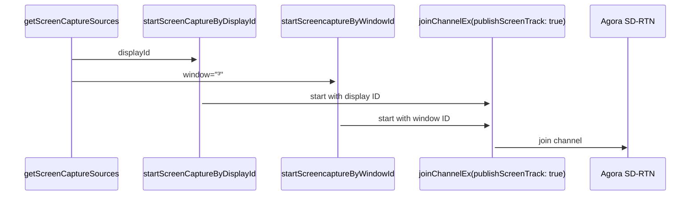

# Sequence Diagram

```mermaid
sequenceDiagram
    participant g as getScreenCaptureSources
    participant d as startScreenCaptureByDisplayId
    participant w as startScreencaptureByWindowId
    participant j as joinChannelEx(publishScreenTrack: true)
    participant a as Agora SD-RTN

    g ->>+ d: displayId
    g ->>+ w: window="³"
    d ->>+ j: start with display ID
    w ->> j: start with window ID
    j ->> a: join channel
```
