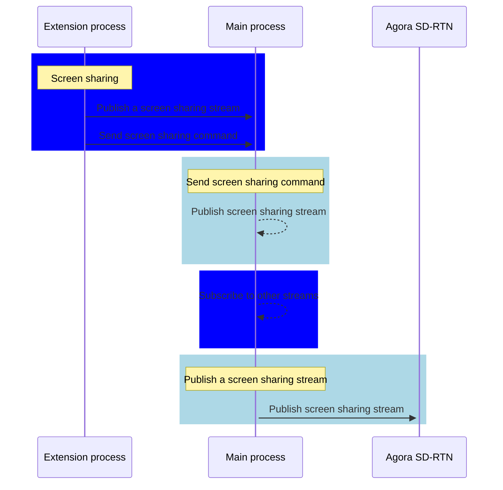

# Sequence Diagram

```mermaid
sequenceDiagram
    participant Extension_process as Extension process
    participant Main_process as Main process
    participant Agora_SD_RTN as Agora SD-RTN

    rect rgb(0, 0, 255)
        Note over Extension_process: Screen sharing
        Extension_process ->>+ Main_process: Publish a screen sharing stream
        Extension_process ->> Main_process: Send screen sharing command
    end

    rect rgb(173, 216, 230)
        Note over Main_process: Send screen sharing command
        Main_process -->> Main_process: Publish screen sharing stream
    end

    rect rgb(0, 0, 255)
        Main_process -->> Main_process: Subscribe to other streams
    end

    rect rgb(173, 216, 230)
        Note over Main_process: Publish a screen sharing stream
        Main_process ->>+ Agora_SD_RTN: Publish screen sharing stream
    end
```
