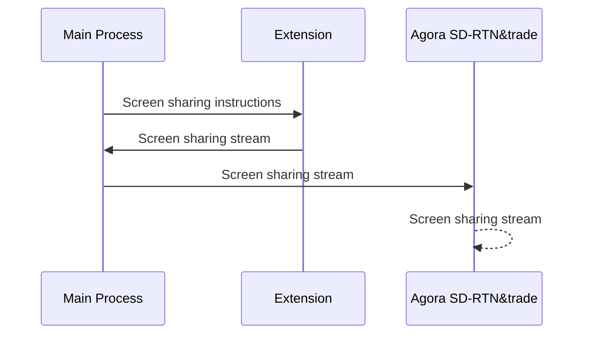

# Sequence Diagram

```mermaid
sequenceDiagram
participant MP as Main Process
participant E as Extension
participant AS as Agora SD-RTN&trade;

rect rgb(255, 255, 255)
    MP->>E: Screen sharing instructions
    E->>MP: Screen sharing stream
    MP->>AS: Screen sharing stream
end

AS-->>AS: Screen sharing stream
```
