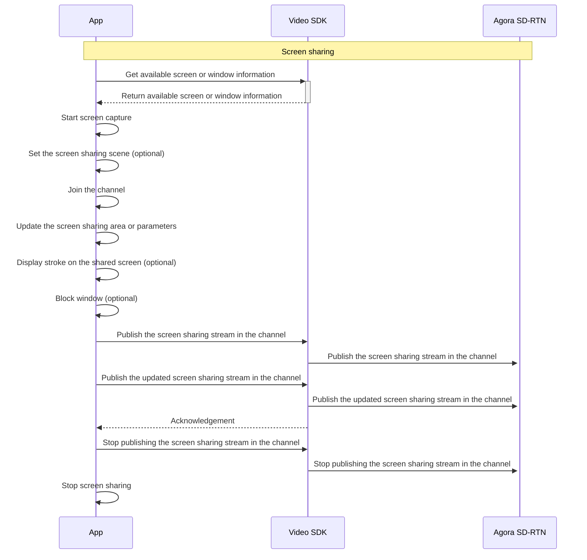

# Sequence Diagram

```mermaid
sequenceDiagram
    participant App as App
    participant Video_SDK as Video SDK
    participant Agora_SD_RTN as Agora SD-RTN

    note over App, Agora_SD_RTN: Screen sharing

    App->>+Video_SDK: Get available screen or window information
    Video_SDK-->>-App: Return available screen or window information
    App->>App: Start screen capture
    App->>App: Set the screen sharing scene (optional)
    App->>App: Join the channel
    App->>App: Update the screen sharing area or parameters
    App->>App: Display stroke on the shared screen (optional)
    App->>App: Block window (optional)
    App->>Video_SDK: Publish the screen sharing stream in the channel
    Video_SDK->>+Agora_SD_RTN: Publish the screen sharing stream in the channel
    App->>Video_SDK: Publish the updated screen sharing stream in the channel
    Video_SDK->>Agora_SD_RTN: Publish the updated screen sharing stream in the channel
    Video_SDK-->>App: Acknowledgement
    App->>Video_SDK: Stop publishing the screen sharing stream in the channel
    Video_SDK->>Agora_SD_RTN: Stop publishing the screen sharing stream in the channel
    App->>App: Stop screen sharing
```
