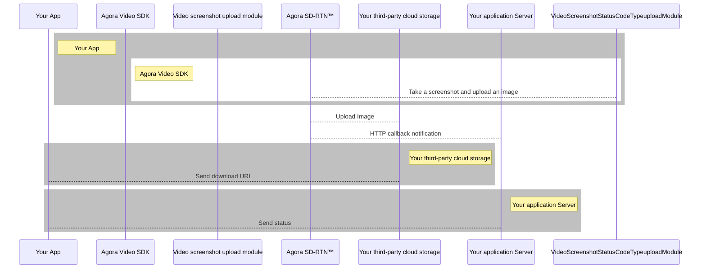

# Sequence Diagram

```mermaid
sequenceDiagram
    participant YourApp as Your App
    participant AgoraVideoSDK as Agora Video SDK
    participant VideoScreenshotUploadModule as Video screenshot upload module
    participant AgoraSDRTN as Agora SD-RTN™
    participant ThirdPartyCloudStorage as Your third-party cloud storage
    participant ApplicationServer as Your application Server

    rect rgb(192, 192, 192)
        note right of YourApp: Your App
        rect rgb(255,255,255)
            note right of AgoraVideoSDK: Agora Video SDK
            VideoScreenshotStatusCodeTypeuploadModule --> AgoraSDRTN: Take a screenshot and upload an image
        end
    end

    AgoraSDRTN --> ThirdPartyCloudStorage: Upload Image
    AgoraSDRTN --> ApplicationServer: HTTP callback notification

    rect rgb(192, 192, 192)
        note right of ThirdPartyCloudStorage: Your third-party cloud storage
        ThirdPartyCloudStorage --> YourApp: Send download URL
    end

    rect rgb(192, 192, 192)
        note right of ApplicationServer: Your application Server
        ApplicationServer --> YourApp: Send status
    end
```
