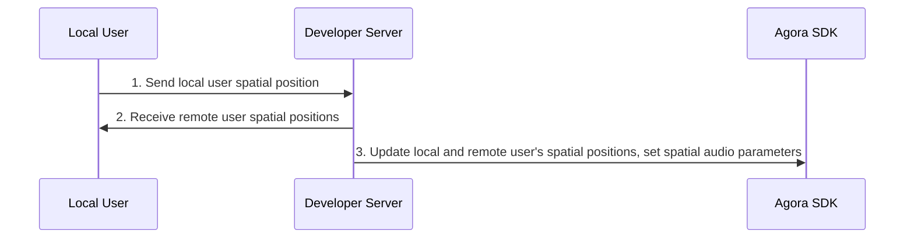

# Sequence Diagram

```mermaid
sequenceDiagram
    participant Local_User as Local User
    participant Developer_server as Developer Server
    participant Agora_SDK as Agora SDK

    Local_User->>Developer_server: 1. Send local user spatial position
    Developer_server->>Local_User: 2. Receive remote user spatial positions
    Developer_server->>Agora_SDK: 3. Update local and remote user's spatial positions, set spatial audio parameters
```
