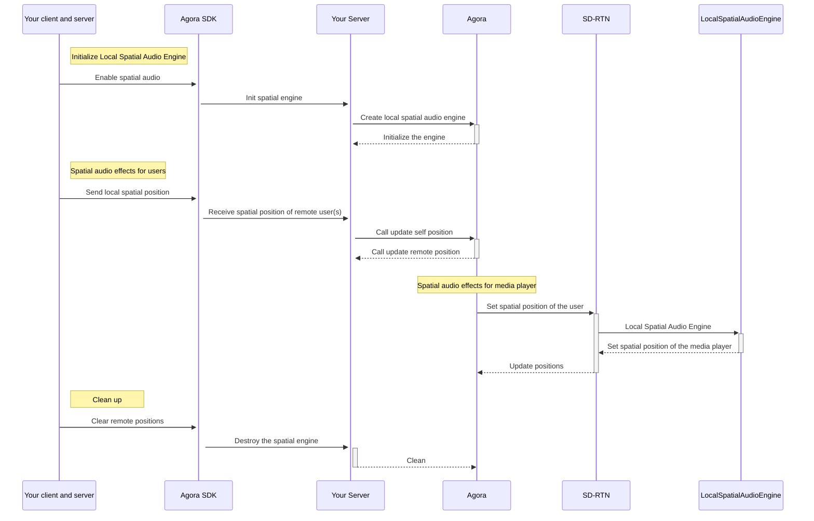

# Sequence Diagram

```mermaid
sequenceDiagram
    participant YourClientAndServer as Your client and server
    participant AgoraSDK as Agora SDK
    participant YourServer as Your Server
    participant Agora as Agora

    rect rgb(255, 255, 255)
        note right of YourClientAndServer: Initialize Local Spatial Audio Engine
        YourClientAndServer ->>+ AgoraSDK: Enable spatial audio
        AgoraSDK ->>+ YourServer: Init spatial engine
        YourServer ->>+ Agora: Create local spatial audio engine
        Agora -->>- YourServer: Initialize the engine
    end

    rect rgb(255, 255, 255)
        note right of YourClientAndServer: Spatial audio effects for users
        YourClientAndServer ->>+ AgoraSDK: Send local spatial position
        AgoraSDK ->>+ YourServer: Receive spatial position of remote user(s)
        YourServer ->>+ Agora: Call update self position
        Agora -->>- YourServer: Call update remote position
    end

    rect rgb(255, 255, 255)
        note over Agora: Spatial audio effects for media player
        Agora ->>+ SD-RTN: Set spatial position of the user
        SD-RTN ->>+ LocalSpatialAudioEngine: Local Spatial Audio Engine
        LocalSpatialAudioEngine -->>- SD-RTN: Set spatial position of the media player
        SD-RTN -->>- Agora: Update positions
    end

    rect rgb(255, 255, 255)
        note right of YourClientAndServer: Clean up
        YourClientAndServer ->>+ AgoraSDK: Clear remote positions
        AgoraSDK ->>+ YourServer: Destroy the spatial engine
        YourServer -->>- Agora: Clean
    end
```
