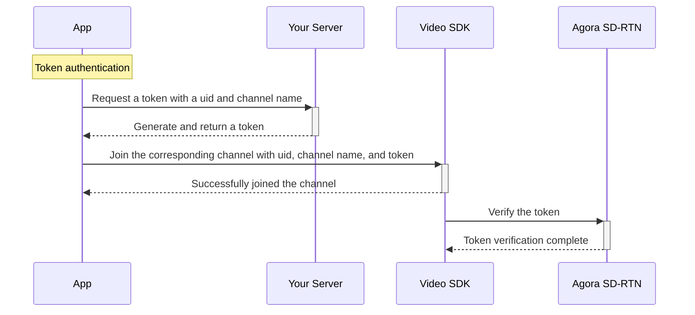

# Sequence Diagram

```mermaid
sequenceDiagram
participant App
participant Your_Server as Your Server
participant Video_SDK as Video SDK
participant Agora_SD_RTN as Agora SD-RTN

note over App: Token authentication

App->>+Your_Server: Request a token with a uid and channel name
Your_Server-->>-App: Generate and return a token
App->>+Video_SDK: Join the corresponding channel with uid, channel name, and token
Video_SDK-->>-App: Successfully joined the channel
Video_SDK->>+Agora_SD_RTN: Verify the token
Agora_SD_RTN-->>-Video_SDK: Token verification complete
```
