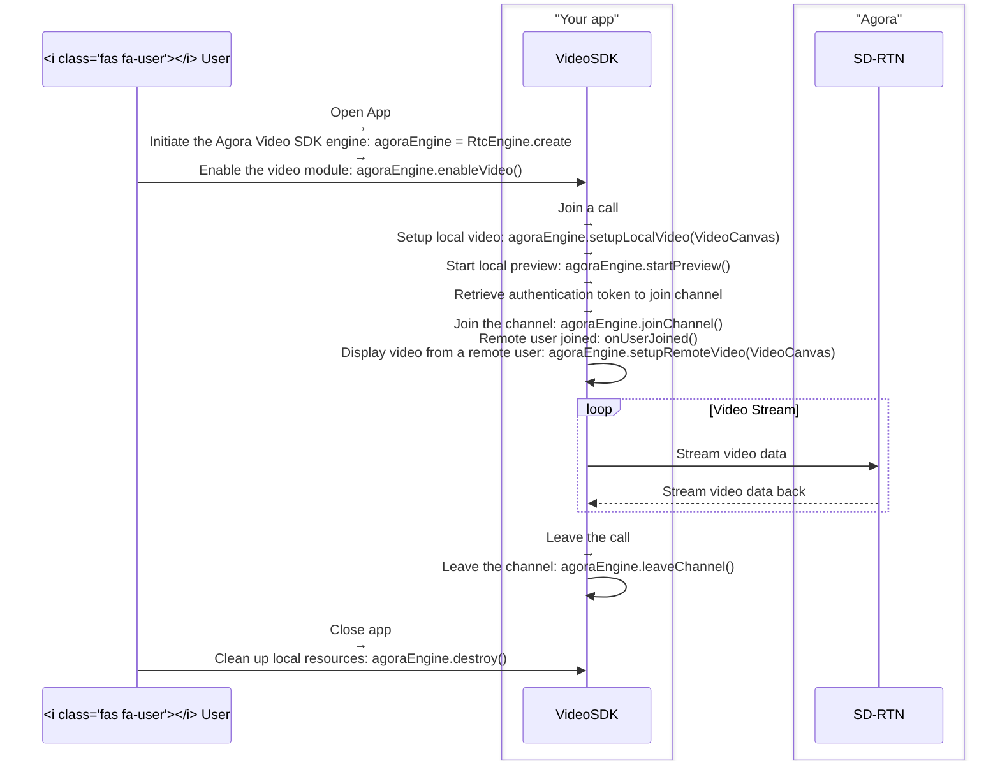

# Sequence Diagram

```mermaid
sequenceDiagram
    participant User as <i class="fas fa-user"></i> User
    box "Your app"
        participant VideoSDK
    end
    box "Agora"
        participant SDRTN as SD-RTN
    end

    User ->> VideoSDK: Open App <br/>→<br/>Initiate the Agora Video SDK engine: agoraEngine = RtcEngine.create<br/>→<br/>Enable the video module: agoraEngine.enableVideo()
    VideoSDK ->> VideoSDK: Join a call <br/>→<br/>Setup local video: agoraEngine.setupLocalVideo(VideoCanvas)<br/>→<br/>Start local preview: agoraEngine.startPreview()<br/>→<br/>Retrieve authentication token to join channel<br/>→<br/>Join the channel: agoraEngine.joinChannel() <br/>Remote user joined: onUserJoined() <br/>Display video from a remote user: agoraEngine.setupRemoteVideo(VideoCanvas)
    loop Video Stream
        VideoSDK ->> SDRTN: Stream video data
        SDRTN -->> VideoSDK: Stream video data back
    end
    VideoSDK ->> VideoSDK: Leave the call <br/>→<br/>Leave the channel: agoraEngine.leaveChannel()
    User ->> VideoSDK: Close app<br/>→<br/>Clean up local resources: agoraEngine.destroy()
```
