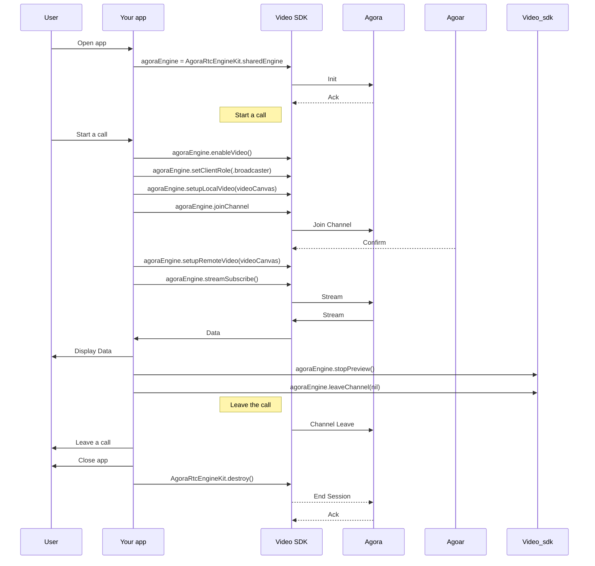

# Sequence Diagram

```mermaid
sequenceDiagram
    participant User
    participant Your_app as Your app
    participant Video_SDK as Video SDK
    participant Agora

    User->>Your_app: Open app
    Your_app->>Video_SDK: agoraEngine = AgoraRtcEngineKit.sharedEngine
    Video_SDK->>Agora: Init
    Agora-->>Video_SDK: Ack
    
    %% Start a Call
    Note left of Video_SDK: Start a call
    User->>Your_app: Start a call
    Your_app->>Video_SDK: agoraEngine.enableVideo()
    Your_app->>Video_SDK: agoraEngine.setClientRole(.broadcaster)
    Your_app->>Video_SDK: agoraEngine.setupLocalVideo(videoCanvas)
    Your_app->>Video_SDK: agoraEngine.joinChannel
    Video_SDK->>Agora: Join Channel
    Agoar-->>Video_SDK: Confirm
    Your_app->>Video_SDK: agoraEngine.setupRemoteVideo(videoCanvas)
    Your_app->>Video_SDK: agoraEngine.streamSubscribe()

    %% In Call Data Exchange
    Video_SDK->>Agora: Stream
    Agora->>Video_SDK: Stream
    Video_SDK->>Your_app: Data
    Your_app->>User: Display Data

    %% Stop a Call
    Your_app->>Video_sdk: agoraEngine.stopPreview()
    Your_app->>Video_sdk: agoraEngine.leaveChannel(nil)
    Note left of Video_SDK: Leave the call
    Video_SDK->>Agora: Channel Leave
    Your_app->>User: Leave a call

    %% Close App
    Your_app->>User: Close app
    Your_app->>Video_SDK: AgoraRtcEngineKit.destroy()
    Video_SDK-->>Agora: End Session
    Agora-->>Video_SDK: Ack
```
