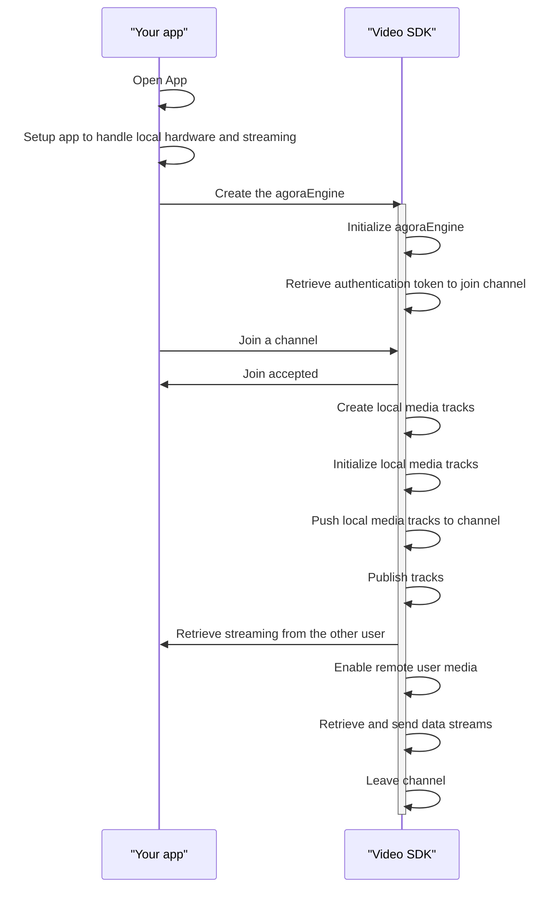

# Sequence Diagram

```mermaid
sequenceDiagram
    participant Your_app as "Your app"
    participant Video_SDK as "Video SDK"

    Your_app->>Your_app: Open App
    Your_app->>Your_app: Setup app to handle local hardware and streaming

    Your_app->>Video_SDK: Create the agoraEngine
    activate Video_SDK
    Video_SDK->>Video_SDK: Initialize agoraEngine

    Video_SDK->>Video_SDK: Retrieve authentication token to join channel

    Your_app->>Video_SDK: Join a channel
    Video_SDK->>Your_app: Join accepted

    Video_SDK->>Video_SDK: Create local media tracks
    Video_SDK->>Video_SDK: Initialize local media tracks

    Video_SDK->>Video_SDK: Push local media tracks to channel
    Video_SDK->>Video_SDK: Publish tracks

    Video_SDK->>Your_app: Retrieve streaming from the other user
    Video_SDK->>Video_SDK: Enable remote user media

    Video_SDK->>Video_SDK: Retrieve and send data streams

    Video_SDK->>Video_SDK: Leave channel
    deactivate Video_SDK
```
