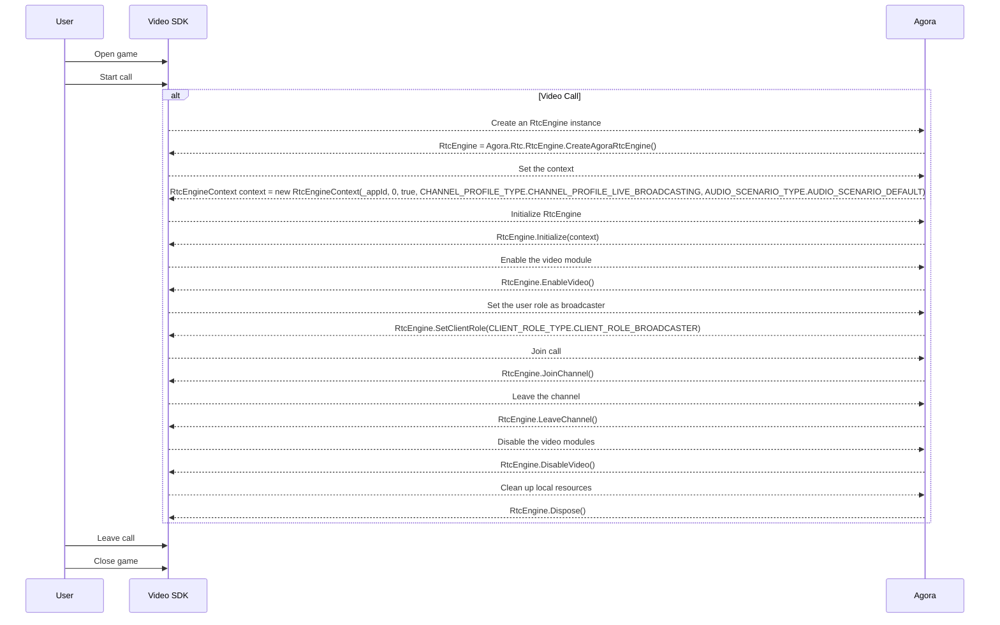

# Sequence Diagram

```mermaid
sequenceDiagram
    participant User
    participant Video_SDK as Video SDK 
    participant Agora

    User->>Video_SDK: Open game
    User->>Video_SDK: Start call
    alt Video Call
        Video_SDK-->>Agora: Create an RtcEngine instance
        Agora-->>Video_SDK: RtcEngine = Agora.Rtc.RtcEngine.CreateAgoraRtcEngine()
        Video_SDK-->>Agora: Set the context
        Agora-->>Video_SDK: RtcEngineContext context = new RtcEngineContext(_appId, 0, true, CHANNEL_PROFILE_TYPE.CHANNEL_PROFILE_LIVE_BROADCASTING, AUDIO_SCENARIO_TYPE.AUDIO_SCENARIO_DEFAULT)
        Video_SDK-->>Agora: Initialize RtcEngine
        Agora-->>Video_SDK: RtcEngine.Initialize(context)
        Video_SDK-->>Agora: Enable the video module
        Agora-->>Video_SDK: RtcEngine.EnableVideo()
        Video_SDK-->>Agora: Set the user role as broadcaster
        Agora-->>Video_SDK: RtcEngine.SetClientRole(CLIENT_ROLE_TYPE.CLIENT_ROLE_BROADCASTER)
        Video_SDK-->>Agora: Join call
        Agora-->>Video_SDK: RtcEngine.JoinChannel()
        Video_SDK-->>Agora: Leave the channel
        Agora-->>Video_SDK: RtcEngine.LeaveChannel()
        Video_SDK-->>Agora: Disable the video modules
        Agora-->>Video_SDK: RtcEngine.DisableVideo()
        Video_SDK-->>Agora: Clean up local resources
        Agora-->>Video_SDK: RtcEngine.Dispose()
    end
    User->>Video_SDK: Leave call
    User->>Video_SDK: Close game
```
