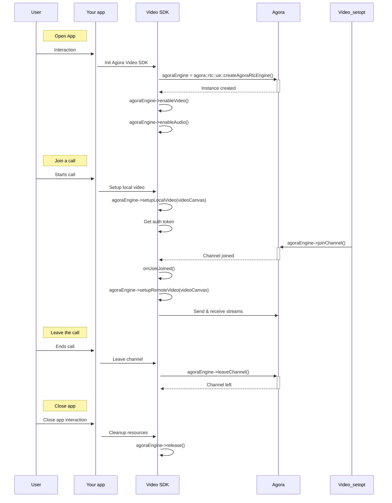

# Sequence Diagram

```mermaid
sequenceDiagram
    participant User
    participant Your_app as Your app
    participant Video_SDK as Video SDK
    participant Agora

    rect rgb(255, 255, 255)
        note right of User: Open App
        User ->>+ Your_app: Interaction
        Your_app ->>+ Video_SDK: Init Agora Video SDK
        Video_SDK ->>+ Agora: agoraEngine = agora::rtc::ue::createAgoraRtcEngine()
        Agora -->>- Video_SDK: Instance created
        Video_SDK ->> Video_SDK: agoraEngine->enableVideo()
        Video_SDK ->> Video_SDK: agoraEngine->enableAudio()
    end

    rect rgb(255, 255, 255)
        note right of User: Join a call
        User ->>+ Your_app: Starts call
        Your_app ->> Video_SDK: Setup local video
        Video_SDK ->> Video_SDK: agoraEngine->setupLocalVideo(videoCanvas)
        Video_SDK ->> Video_SDK: Get auth token
        Video_setopt ->>+ Agora: agoraEngine->joinChannel()
        Agora -->>- Video_SDK: Channel joined
        Video_SDK ->> Video_SDK: onUserJoined()
        Video_SDK ->> Video_SDK: agoraEngine->setupRemoteVideo(videoCanvas)
        Video_SDK ->> Agora: Send & receive streams
    end

    rect rgb(255, 255, 255)
        note right of User: Leave the call
        User ->>+ Your_app: Ends call
        Your_app ->>+ Video_SDK: Leave channel
        Video_SDK ->>+ Agora: agoraEngine->leaveChannel()
        Agora -->>- Video_SDK: Channel left
    end

    rect rgb(255, 255, 255)
        note right of User: Close app
        User ->>+ Your_app: Close app interaction
        Your_app ->> Video_SDK: Cleanup resources
        Video_SDK ->> Video_SDK: agoraEngine->release()
    end
```
