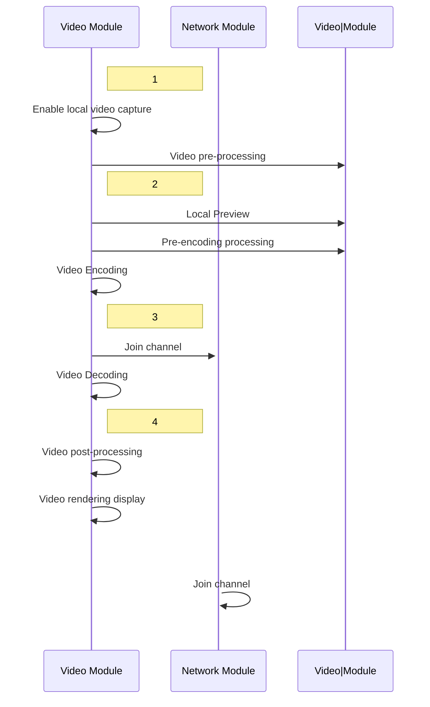

# Sequence Diagram

```mermaid
sequenceDiagram
    participant VideoModule as Video Module
    participant NetworkModule as Network Module

    rect rgb(255, 255, 255)
        note right of VideoModule: 1
        VideoModule->>VideoModule: Enable local video capture
        VideoModule->>Video|Module: Video pre-processing
        note right of VideoModule: 2
        VideoModule->>Video|Module: Local Preview
        VideoModule->>Video|Module: Pre-encoding processing
        VideoModule->>VideoModule: Video Encoding
        note right of VideoModule: 3
        VideoModule->>+NetworkModule: Join channel
        VideoModule->>VideoModule: Video Decoding
        note right of VideoModule: 4
        VideoModule->>VideoModule: Video post-processing
        VideoModule->>VideoModule: Video rendering display
    end

    rect rgb(255, 255, 255)
        NetworkModule->>NetworkModule: Join channel
    end
```
