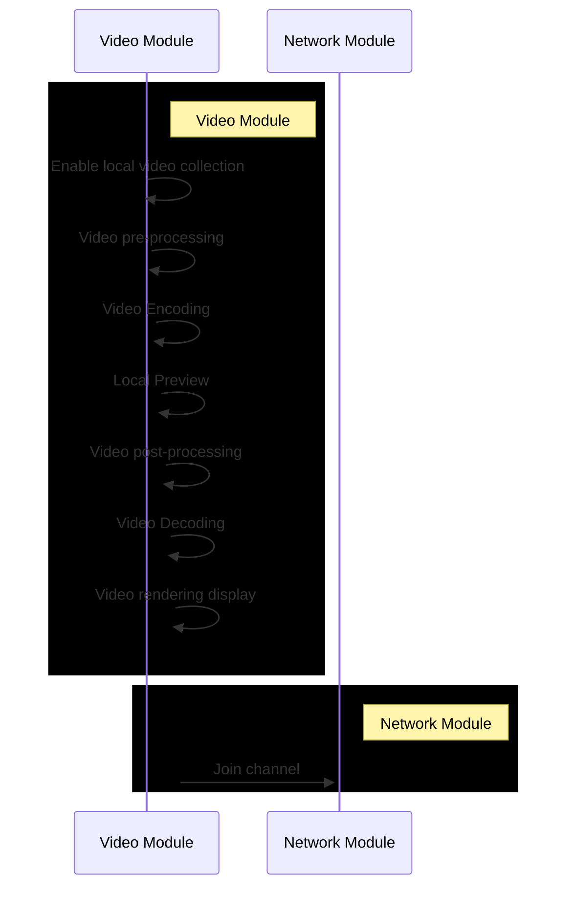

# Sequence Diagram

```mermaid
sequenceDiagram
    participant V as Video Module
    participant N as Network Module

    rect rgb(0,0,0)
    note right of V: Video Module
    V->>+V: Enable local video collection
    V->>+V: Video pre-processing
    V->>+V: Video Encoding
    V->>+V: Local Preview
    V->>+V: Video post-processing
    V->>+V: Video Decoding
    V->>+V: Video rendering display
    end

    rect rgb(0,0,0)
    note right of N: Network Module
    V->>+N: Join channel
    end
```
