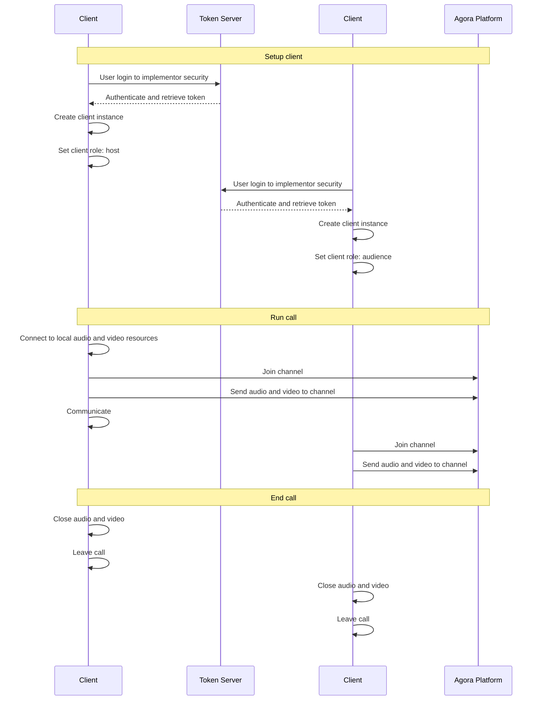

# Sequence Diagram

```mermaid
sequenceDiagram
    participant Client1 as Client
    participant TokenServer as Token Server
    participant Client2 as Client
    participant Agora as Agora Platform

    %% Setup Client
    rect rgb(255, 255, 255)
        note over Client1, Agora: Setup client
        Client1->>TokenServer: User login to implementor security
        TokenServer-->>Client1: Authenticate and retrieve token
        Client1->>Client1: Create client instance
        Client1->>Client1: Set client role: host

        Client2->>TokenServer: User login to implementor security
        TokenServer-->>Client2: Authenticate and retrieve token
        Client2->>Client2: Create client instance
        Client2->>Client2: Set client role: audience
    end

    %% Run Call
    rect rgb(255, 255, 255)
        note over Client1, Agora: Run call
        Client1->>Client1: Connect to local audio and video resources
        Client1->>Agora: Join channel
        Client1->>Agora: Send audio and video to channel
        Client1->>Client1: Communicate

        Client2->>Agora: Join channel
        Client2->>Agora: Send audio and video to channel
    end

    %% End Call
    rect rgb(255, 255, 255)
        note over Client1, Agora: End call
        Client1->>Client1: Close audio and video
        Client1->>Client1: Leave call

        Client2->>Client2: Close audio and video
        Client2->>Client2: Leave call
    end
```
