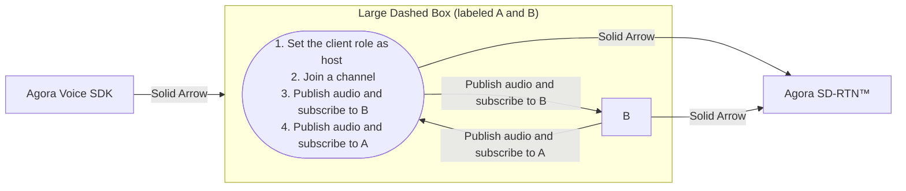

# Sequence Diagram

```mermaid
flowchart LR
    AgoraVoiceSDK[Agora Voice SDK] -->|Solid Arrow| GroupADashedBox
    subgraph GroupADashedBox["Large Dashed Box (labeled A and B)"]
        A(["1. Set the client role as host <br>2. Join a channel<br>3. Publish audio and subscribe to B<br>4. Publish audio and subscribe to A"]) -->|Publish audio and subscribe to B| B
        B -->|Publish audio and subscribe to A| A
    end
    A -->|Solid Arrow| AgoraSDRTN
    B -->|Solid Arrow| AgoraSDRTN[Agora SD-RTN&trade;]
```
