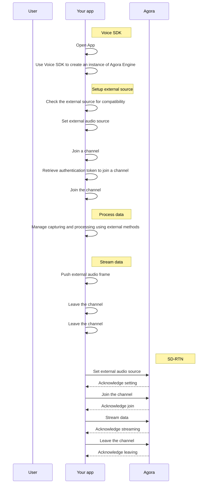

# Sequence Diagram

```mermaid
sequenceDiagram
    participant User as User
    participant YourApp as Your app
    participant Agora as Agora

    rect rgb(255, 255, 255)
        note right of YourApp: Voice SDK
        YourApp->>YourApp: Open App
        YourApp->>YourApp: Use Voice SDK to create an instance of Agora Engine
        
        rect rgb(255, 255, 255)
            note right of YourApp: Setup external source
            YourApp->>YourApp: Check the external source for compatibility
            YourApp->>YourApp: Set external audio source
        end

        YourApp->>YourApp: Join a channel
        YourApp->>YourApp: Retrieve authentication token to join a channel
        YourApp->>YourApp: Join the channel

        rect rgb(255, 255, 255)
            note right of YourApp: Process data
            YourApp->>YourApp: Manage capturing and processing using external methods
        end

        rect rgb(255, 255, 255)
            note right of YourApp: Stream data
            YourApp->>YourApp: Push external audio frame
        end

        YourApp->>YourApp: Leave the channel
        YourApp->>YourApp: Leave the channel
    end

    rect rgb(255, 255, 255)
        note right of Agora: SD-RTN
        YourApp->>Agora: Set external audio source
        Agora-->>YourApp: Acknowledge setting

        YourApp->>Agora: Join the channel
        Agora-->>YourApp: Acknowledge join

        YourApp->>Agora: Stream data
        Agora-->>YourApp: Acknowledge streaming

        YourApp->>Agora: Leave the channel
        Agora-->>YourApp: Acknowledge leaving
    end
```
