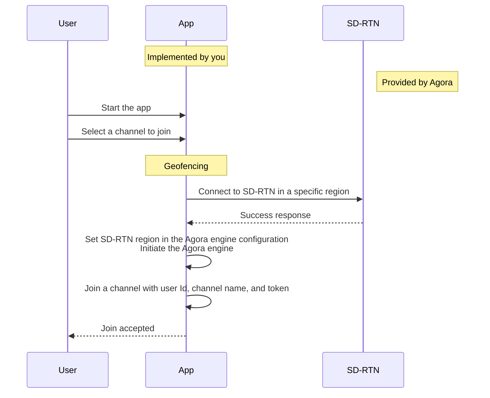

# Sequence Diagram

```mermaid
sequenceDiagram
participant User
participant App
participant SD-RTN

Note over App: Implemented by you
Note right of SD-RTN: Provided by Agora

User ->> App: Start the app
User ->> App: Select a channel to join

rect rgb(255, 255, 255)
Note over App: Geofencing

App ->> SD-RTN: Connect to SD-RTN in a specific region
SD-RTN -->> App: Success response
App ->> App: Set SD-RTN region in the Agora engine configuration<br>Initiate the Agora engine
App ->> App: Join a channel with user Id, channel name, and token
App -->> User: Join accepted

end
```
