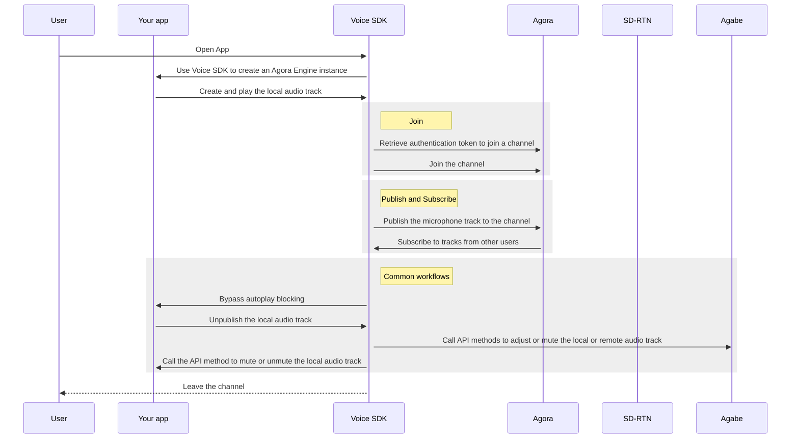

# Sequence Diagram

```mermaid
sequenceDiagram
    participant User as User
    participant App as Your app
    participant SDK as Voice SDK
    participant Agora as Agora
    participant SDRTN as SD-RTN
    
    User ->>+ SDK: Open App
    SDK ->>+ App: Use Voice SDK to create an Agora Engine instance
    App ->>+ SDK: Create and play the local audio track
    
    rect rgb(238, 238, 238)
    note right of SDK: Join
    SDK ->>+ Agora: Retrieve authentication token to join a channel
    SDK ->> Agora: Join the channel
    end
    
    rect rgb(238, 238, 238)
    note right of SDK: Publish and Subscribe
    SDK ->>+ Agora: Publish the microphone track to the channel
    Agora ->> SDK: Subscribe to tracks from other users
    end
    
    rect rgb(238, 238, 238)
    note right of SDK: Common workflows
    SDK ->> App: Bypass autoplay blocking
    App ->> SDK: Unpublish the local audio track
    SDK ->> Agabe: Call API methods to adjust or mute the local or remote audio track
    SDK ->> App: Call the API method to mute or unmute the local audio track
    end
    
    SDK -->> User: Leave the channel
```
