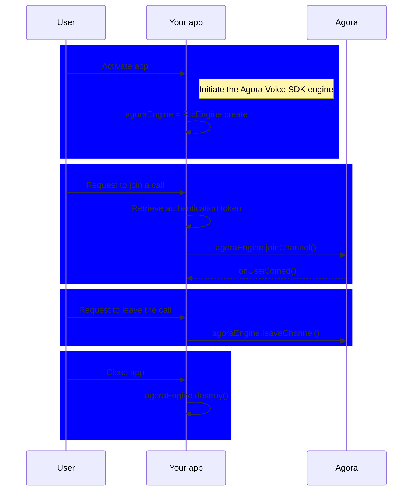

# Sequence Diagram

```mermaid
sequenceDiagram
    participant User
    participant Your_app as Your app
    participant Agora

    %% Group: Open App
    rect rgb(0,0,255)
        User->>Your_app: Activate app
        Note right of Your_app: Initiate the Agora Voice SDK engine
        Your_app->>Your_app: agoraEngine = RtcEngine.create
    end

    %% Group: Join a Call
    rect rgb(0,0,255)
        User->>Your_app: Request to join a call
        Your_app->>Your_app: Retrieve authentication token
        Your_app->>Agora: agoraEngine.joinChannel()
        Agora-->>Your_app: onUserJoined()
    end

    %% Group: Leave the Call
    rect rgb(0,0,255)
        User->>Your_app: Request to leave the call
        Your_app->>Agora: agoraEngine.leaveChannel()
    end

    %% Group: Close App
    rect rgb(0,0,255)
        User->>Your_app: Close app
        Your_app->>Your_app: agoraEngine.destroy()
    end
```
