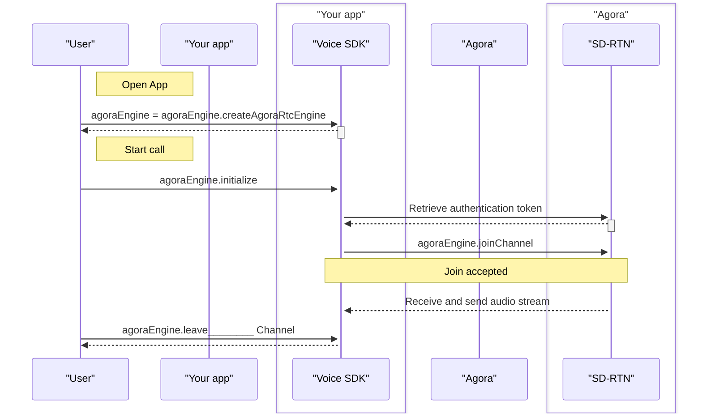

# Sequence Diagram

```mermaid
sequenceDiagram
    participant User as "User"
    participant App as "Your app"
    box "Your app"
        participant SDK as "Voice SDK"
    end
    participant Agora as "Agora"
    box "Agora"
        participant SDRTN as "SD-RTN"
    end

    Note right of User: Open App
    User ->>+ SDK: agoraEngine = agoraEngine.createAgoraRtcEngine
    SDK -->>- User: 
    Note right of User: Start call
    User ->>+ SDK: agoraEngine.initialize
    SDK ->>+ SDRTN: Retrieve authentication token
    SDRTN -->>- SDK: 
    SDK ->>+ SDRTN: agoraEngine.joinChannel
    Note over SDRTN, SDK: Join accepted
    SDRTN -->> SDK: Receive and send audio stream
    User ->> SDK: agoraEngine.leave________ Channel
    SDK -->> User:
```
