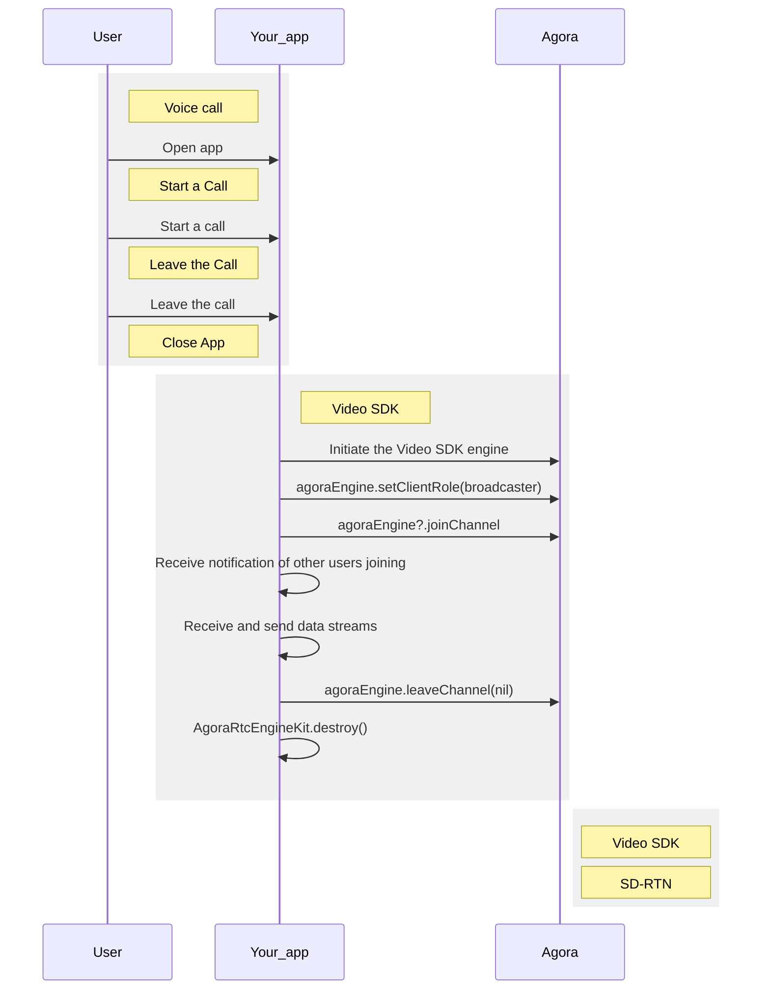

# Sequence Diagram

```mermaid
sequenceDiagram
    participant User
    participant Your_app
    participant Agora

    rect rgb(240, 240, 240)
    note right of User: Voice call
    User->>Your_app: Open app
    note right of User: Start a Call
    User->>Your_app: Start a call
    note right of User: Leave the Call
    User->>Your_app: Leave the call
    note right of User: Close App
    end

    rect rgb(240, 240, 240)
    note right of Your_app: Video SDK
    Your_app->>Agora: Initiate the Video SDK engine
    Your_app->>Agora: agoraEngine.setClientRole(broadcaster)
    Your_app->>Agora: agoraEngine?.joinChannel
    Your_app->>Your_app: Receive notification of other users joining
    Your_app->>Your_app: Receive and send data streams
    Your_app->>Agora: agoraEngine.leaveChannel(nil)
    Your_app->>Your_app: AgoraRtcEngineKit.destroy()
    end

    rect rgb(240, 240, 240)
    note right of Agora: Video SDK
    note right of Agora: SD-RTN
    end
```
